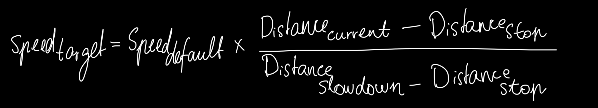
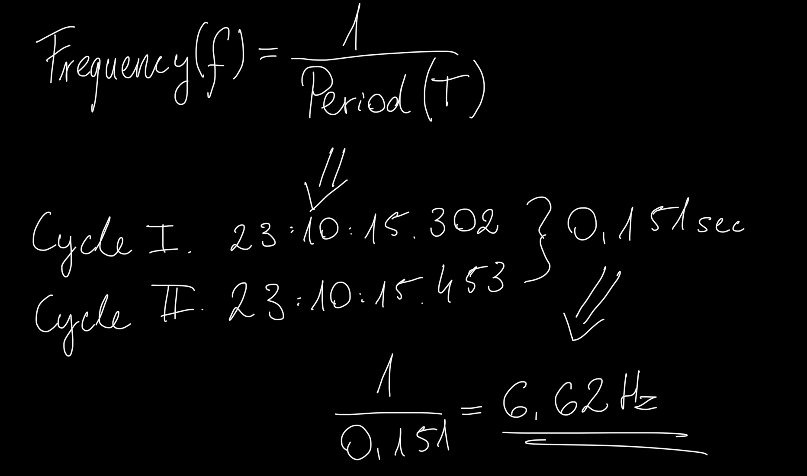

# Interim Project Status Report: Autonomous Rover (Phase 1)

Date: December 12, 2025

System State: "Lidar-Only" Navigation with Single-Threaded Logic

## I. System Architecture

The project currently employs a modular **Strategy Pattern** architecture to allow for seamless switching between sensor modes (LiDAR, Camera, Fusion). The system is divided into three distinct layers:

### 1. The Controller Layer (`main.py`)

-   **Role:** Acts as the central "Brain." It orchestrates the sensing-decision-actuation loop.
    
-   **Implementation:** It does not contain low-level logic. Instead, it queries the active `Strategy` for safety data and commands the `MotorDriver` based on high-level behaviors (Forward, Avoid, Turn).
    

### 2. The Perception Layer (`lidar_strategy.py`)

-   **Protocol:** Implements the LD19 LiDAR binary protocol (UART, 230400 baud).
    
-   **Packet Parsing:** Decodes 47-byte packets to extract 12 distance points per packet.
    
-   **Data Transformation:** Converts polar coordinates (Angle/Distance) into a semantic **Sector Model**:
    
    -   **Front Tunnel:** $\pm 20^\circ$ (Narrow cone to match robot width).
        
    -   **Left/Right Sectors:** Remaining Field of View ($20^\circ \text{ to } 90^\circ$).
        
-   **Noise Filtering:** Implements a "Min-Filter" to find the closest object in each sector, filtering out noise > 200cm.
    

### 3. The Hardware Abstraction Layer (`motor_driver.py`)

-   **Role:** Decouples specific GPIO pin logic from the main application.
    
-   **Safety Features:**
    
    -   **Clamping:** Hard limits on maximum motor speed (1.0) to prevent hardware damage.
        
    -   **Dead Zone Remapping:** Software fix for hardware limitations. Maps the logical speed range ($0.1 - 1.0$) to the physical motor capabilities ($0.2 - 1.0$).
        
    -   **Smooth Ramping:** Implementing a step-based acceleration loop to prevent mechanical jerk and gearbox wear.
        

----------

## II. Algorithmic Implementation

### 1. Proportional Speed Control (P-Controller)

To mimic organic movement, the robot modulates speed based on obstacle distance using a linear P-Controller.

-   **Observation from Logs:** The logs confirm this linear scaling works effectively.
    
    -   _At 78cm:_ `Speed = 0.50` (Cruising)
        
    -   _At 40cm:_ `Speed = 0.17` (Braking)
        
    -   _At 20cm:_ `Speed = 0.10` (Crawl)
        

### 2. Multi-Zone Braking Logic

The braking system defines two distinct zones for safety:

-   **Polite Stop ($20cm - 90cm$):** Uses the P-Controller to decelerate smoothly.
    
-   **Panic Stop ($< 10cm$):** Triggers an immediate "Force Stop," bypassing the smooth ramp-down to lock the motors instantly.
    

### 3. Smart Avoidance

Instead of random turning, the robot compares the aggregate open space in the **Left** vs. **Right** sectors.

-   **Log Evidence:** `TURN_LEFT (L:49.7 > R:39.3)`. The robot correctly identified that the Left side had 10cm more clearance and chose that path.
    

----------

## III. Challenges & Engineering Solutions

### 1. The "Heavy Payload" Issue (Stalling)

-   **Challenge:** The DC TT motors lacked the torque to carry the USB Powerbank at low speeds (PWM < 0.3), causing stalls during precise maneuvers.
    
-   **Software Solution:** Implemented **Dead Zone Remapping**. A request for "10% speed" is now automatically boosted to the physical minimum ("Stall Threshold" of 0.2), ensuring the robot crawls without stalling.
    
-   **Hardware Solution (Interim):** Adopted a "Tethered" approach (operator holds the power bank) to isolate algorithmic performance from mechanical constraints for the purpose of the thesis.
    

### 2. Latency vs. Inertia

-   **Challenge:** The single-threaded architecture creates a "Stop-and-Stare" behavior.
    
-   **Metric:** Analysis of log timestamps shows a cycle time of **~0.151 seconds** ($15.453 - 15.302$).
    
    -   **Frequency:** $\approx 6.6 \text{ Hz}$.
    -   In science and engineering, Frequency ($Hz$) is simply the number of times an event happens per second. It is calculated using the Period ($T$), which is the time duration of one single cycle.

        
-   **Consequence:** At full speed, the robot travels blind for ~0.15s between decisions.
    
-   **Mitigation:** Increased `STOPPING_DIST_CM` to 20cm and `SLOWDOWN_DIST_CM` to 90cm to account for this latency.
    

### 3. Sensor Field of View

-   **Challenge:** Initially used a $90^\circ$ Front Cone. The robot stopped for obstacles that were to the side, not directly in the path.
    
-   **Solution:** Refined "Front" sector to a **Tunnel** ($\pm 20^\circ$) to match the physical width of the chassis.
    

----------

## IV. Future Work & Optimization

### Immediate Goal: Multithreading

The current **6.6 Hz** frequency is the primary bottleneck. It is caused by the main loop waiting for the LiDAR scan ($0.15s$) to complete.

-   **Next Step:** Move `check_path()` to a background thread.
    
-   **Hypothesis:** This will decouple Sensing from Acting, potentially increasing the control loop frequency from **6 Hz** to **100+ Hz**, enabling seamless, non-stop driving.

----------

[the file was edited with stackedit.io](https://stackedit.io/app)
