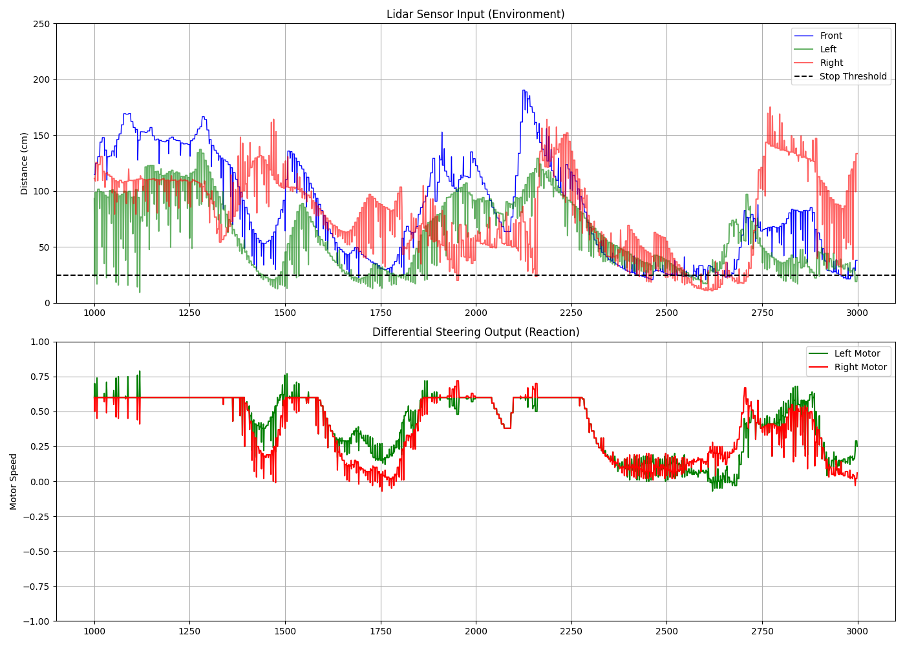

# **Proportional differential steering algorithm**

## Analysis of Complex Avoidance Maneuvers
 
Figure [1] presents a detailed 2,000-frame window of the rover's autonomous navigation behavior. The telemetry demonstrates the effectiveness of the proportional differential steering algorithm in three distinct scenarios:

1.  **The "Left Wall Hug" (Index 1400 - 1500):**
     
	-   **Observation:** The green sensor line (Left Distance) drops critically low, touching the 25cm safety threshold.
         
	 -   **Reaction:** Simultaneously, the Left Motor (Green line, bottom chart) surges to **0.75 speed**, while the Right Motor (Red line) drops to **0.0 speed**.
         
    -   **Result:** This maximum differential creates a sharp right turn, successfully peeling the robot away from the collision course.
         
2.  **The "Narrow Corridor" Stabilization (Index 1900 - 2100):**
    
    -   **Observation:** Both Left and Right sensors show fluctuating distances, indicating a cluttered or narrow path.
         
    -   **Reaction:** The motor lines oscillate tightly around the 0.60 base speed.
         
    -   **Result:** The robot is "micro-correcting" its path in real-time, maintaining a center line without drastic swerving. This proves the `TURN_SPEED` constant (0.25) is correctly tuned to prevent oscillation.
         
3.  **The "Open Space" Acceleration (Index 2100 - 2250):**
     
    -   **Observation:** The Front Distance (Blue line) opens up significantly.
         
    -   **Reaction:** Both motor lines flatten out at exactly **0.60**.
         
    -   **Result:** The robot recognizes safety and locks into a stable cruising speed, maximizing efficiency.
       